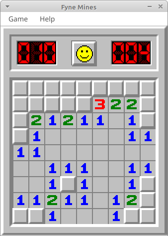

# Fyne Mines

Implementation of minesweeper in Go using the Fyne GUI library.

### Building

Install Fyne dependencies:

    sudo apt install golang gcc libgl1-mesa-dev xorg-dev

Install go packages:

    go mod download

Run the application:

    go run .

Note that the first build may take several minutes (!).

### Graphics and rules

"[Minesweeper X](https://www.curtisbright.com/msx/)" by Curtis Bright is IMHO the best implementation of Minesweeper ever made. He also provided a [skinning system](https://www.curtisbright.com/msx/skins/skinelements.png). For the rules of the game I have been reading the [MinesweeperGame.com](https://minesweepergame.com) website. As a reference I have also looked at the great [Minesweeper Online](https://minesweeperonline.com) implementation in Javascript.
