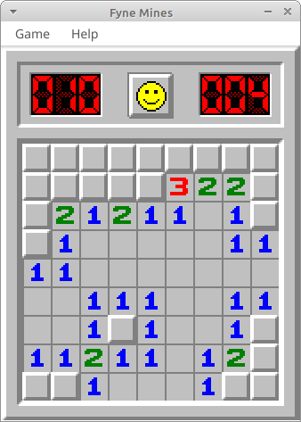

# Fyne Mines

Implementation of minesweeper in Go using the [Fyne](https://fyne.io/) GUI
library.

### Building

Install Fyne dependencies:

    sudo apt install golang gcc libgl1-mesa-dev xorg-dev

Install go packages:

    go mod download

Run the application:

    go run .

Note that the first build may take several minutes (!).

### Package using fyne-cross

Install fyne-cross using:

    go install github.com/fyne-io/fyne-cross@latest

Now run the package.sh script to build all binaries.

### OSX build

Cross compiling to macOS needs a copy of the macOS SDK, which fyne-cross does
not ship. Use 12.3 or newer, because the Go standard library links against
`SecTrustCopyCertificateChain`, which was added in macOS 12.

Download the SDK:

    mkdir -p ~/SDKs && cd ~/SDKs
    curl -LO https://github.com/joseluisq/macosx-sdks/releases/download/12.3/MacOSX12.3.sdk.tar.xz
    tar xf MacOSX12.3.sdk.tar.xz

fyne-cross 1.6.3 mounts the SDK at /sdk and tells zig to link against
`-F/System/Library/Frameworks`, but zig only applies the sysroot to `-L`, not to
`-F`, so every framework fails to resolve. Build a darwin image that has the
path symlinked into the mounted SDK:

    docker build -t fyne-cross-darwin-sdk - <<EOF
    FROM fyneio/fyne-cross-images:darwin
    RUN mkdir -p /System/Library && ln -s /sdk/System/Library/Frameworks /System/Library/Frameworks
    EOF

Then build the binaries:

    ~/go/bin/fyne-cross darwin -arch=amd64,arm64 -app-id com.tqdev.fyne-mines -macosx-sdk-path ~/SDKs/MacOSX12.3.sdk -image fyne-cross-darwin-sdk

The first run pulls the darwin container image, which is a few gigabytes. Unlike
the linux and windows targets, `-app-id` is required.

The package.sh script builds the image, runs this for both architectures and
zips the resulting app bundles. It expects the SDK in the location above,
override it with the `MACOSX_SDK` environment variable.

The resulting app is unsigned, so macOS refuses to open it on first launch. Use
the Open entry in the right click menu, or drop the quarantine flag with
`xattr -dr com.apple.quarantine fyne-mines.app`.

### Running without a GPU on OSX

macOS refuses to create an OpenGL context on a host without a GPU, such as a
virtual machine, and the app exits with:

    FormatUnavailable: NSGL: Failed to find suitable pixel format

Start it with `GLFW_SOFTWARE_RENDERER` set to fall back to Apple's CPU
renderer, which is slower but does not need a GPU:

    GLFW_SOFTWARE_RENDERER=1 fyne-mines.app/Contents/MacOS/fyne-mines

Run the executable directly like that, because `open` does not pass the
environment on to the app it launches.

This needs the patched glfw in third_party, see the README there.

### Releasing

Bump `Version` in FyneApp.toml, commit and push, then run the release.sh
script. It reads the version, tags the current commit and uploads the six
binaries from fyne-cross/dist as a GitHub release, so run package.sh first.
The release title defaults to the tag, pass one as the first argument to
override it:

    ./release.sh "Update dependencies"

### Graphics and rules

"[Minesweeper X](https://www.curtisbright.com/msx/)" by Curtis Bright is IMHO
the best implementation of Minesweeper ever made. He also provided a
[skinning system](https://www.curtisbright.com/msx/skins/skinelements.png). For
the rules of the game I have been reading the
[MinesweeperGame.com](https://minesweepergame.com) website. As a reference I
have also looked at the great
[Minesweeper Online](https://minesweeperonline.com) implementation in
Javascript.

### Links

You can read some background information on creating this game on my blog:

- [Minesweeper written in Go using Fyne](https://tqdev.com/2024-minesweeper-in-go-using-fyne)
- [A 2D puzzle game in Go using Fyne](https://tqdev.com/2024-creating-a-2d-puzzle-game-in-fyne)
